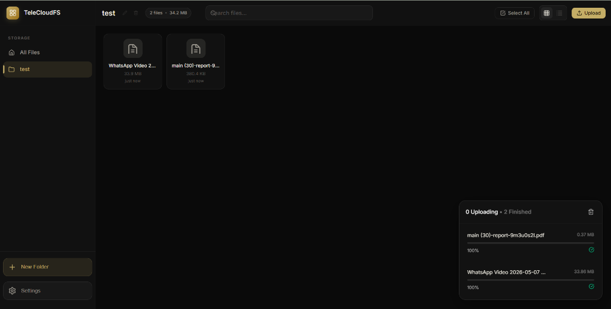
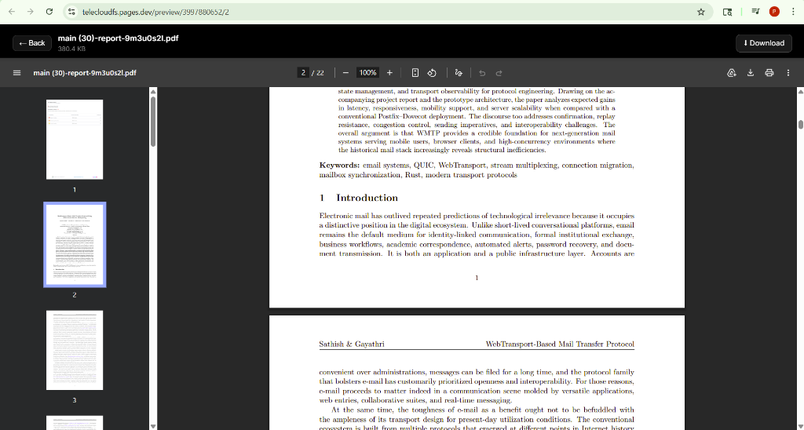
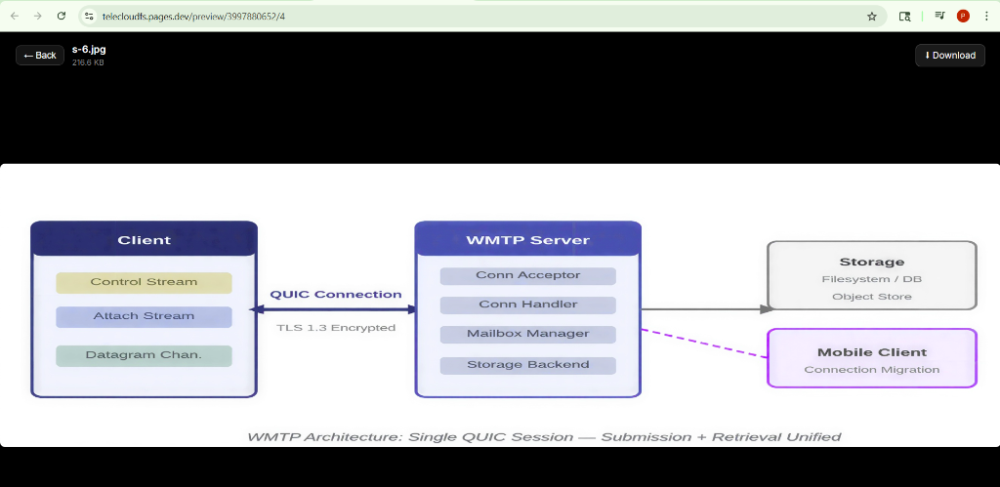
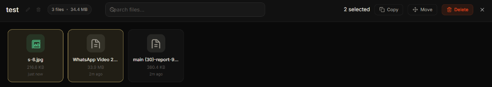

# TeleCloudFS 2.0 🚀

**TeleCloudFS** is a high-performance, secure, and professional cloud storage solution built on top of Telegram's MTProto API and Cloudflare's serverless infrastructure. It transforms your Telegram account into an unlimited, organized cloud drive with a modern, Google Drive-inspired interface.

---

## 📸 Overview

### 🖥️ Modern Dashboard

*A sleek, high-performance dashboard for managing all your Telegram-hosted files.*

### 📄 Professional Document Preview

*Built-in high-fidelity preview for PDFs and documents.*

### 🖼️ High-Speed Media Streaming

*Instant, buffer-free image and video streaming directly from Telegram.*

### 🛠️ Powerful File Operations

*Advanced multi-select actions for moving, copying, and deleting files with ease.*

---

## ✨ Key Features

- **🛡️ Secure by Design**: End-to-end session encryption using master passwords stored in a secure Cloudflare D1 vault. Zero reliance on browser storage for sensitive data.
- **⚡ High-Performance Streaming**: Leverages 16 parallel workers for the fastest possible MTProto streaming, ensuring instant playback of high-resolution media.
- **📁 Advanced Organization**: Create virtual folders, move/copy files between channels, and search with powerful filters.
- **🔄 Live Upload Sync**: Real-time upload manager with per-file progress tracking and automatic list refreshing.
- **📱 Fully Responsive**: Optimized for Desktop, Tablet, and Mobile devices with a native-app feel.
- **🌐 Serverless Architecture**: Powered by Cloudflare Pages and D1 for maximum uptime and zero maintenance overhead.

---

## 🛠 Tech Stack

- **Frontend**: React 18, TypeScript, Vite.
- **Styling**: Premium Vanilla CSS (Mobile-First, Glassmorphism).
- **Backend**: Cloudflare Pages Functions (Edge Runtime).
- **Database**: Cloudflare D1 (Serverless SQL).
- **Protocol**: MTProto (via GramJS) with custom streaming optimizations.

---

## 🚀 Getting Started

### 📋 Prerequisites

1.  A **Telegram Account**.
2.  `API_ID` and `API_HASH` from [my.telegram.org](https://my.telegram.org).
3.  A **Cloudflare Account** with Pages and D1 enabled.

### 📦 Installation & Deployment

1.  **Clone the Repo**:
    ```bash
    git clone https://github.com/poolcore1-ctrl/telecloudfs.git
    cd telecloudfs
    ```

2.  **Install Dependencies**:
    ```bash
    cd app && npm install
    ```

3.  **Deploy to Cloudflare**:
    - Connect your fork to **Cloudflare Pages**.
    - Set the build command to `npm run build` and output to `dist`.
    - Create a **D1 Database** named `DB` and bind it to your Pages project.

4.  **Launch**:
    - Open your deployed URL and follow the setup wizard to securely link your Telegram account.

---

## 🤝 Contributing

We welcome contributions! Whether it's fixing bugs, adding features, or improving documentation, feel free to open a Pull Request.

---

## 📄 License

This project is licensed under the MIT License - see the [LICENSE](LICENSE) file for details.
